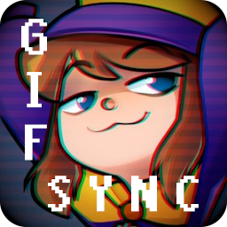

[![Contributors][contributors-shield]][contributors-url]
[![Forks][forks-shield]][forks-url]
[![Stargazers][stars-shield]][stars-url]
[![Issues][issues-shield]][issues-url]
[![MIT License][license-shield]][license-url]


<!-- PROJECT LOGO -->
<br />
<div align="center">
  <a href="https://github.com/Septem151/gifsync">
    
  </a>

  <h3 align="center">GifSync</h3>

  <p align="center">
    Synchronize the speed of Gifs to music on Spotify in real time
    <br />
    <!-- EXCLUDE DOCS
    <a href="https://github.com/Septem151/gifsync"><strong>Explore the docs »</strong></a>
    -->
    <br />
    <br />
    <!-- EXCLUDE VIEW DEMO
    <a href="https://github.com/Septem151/gifsync">View Demo</a>
    ·
    -->
    <a href="https://github.com/Septem151/gifsync/issues">Report Bug</a>
    ·
    <a href="https://github.com/Septem151/gifsync/issues">Request Feature</a>
  </p>
</div>


<!-- TABLE OF CONTENTS -->
## Table of Contents

* [About the Project](#about-the-project)
  * [Built With](#built-with)
* [Getting Started](#getting-started)
  <!-- * [Prerequisites](#prerequisites) -->
  <!-- * [Installation](#installation) -->
* [Usage](#usage)
* [Roadmap](#roadmap)
* [Contributing](#contributing)
* [License](#license)
* [Contact](#contact)


<!-- ABOUT THE PROJECT -->
## About The Project
<!-- EXCLUDE PROJECT SCREENSHOT
[![GifSync Screen Shot][project-screenshot]](https://example.com)
-->
GifSync started out as a simple question: "How do I get [Hat Kid][a-hat-in-time] to dance to my music while I stream?" The answer to this question quickly turned into a long and convoluted dive into APIs, gif frame-times, and web servers.

However, through the power of **THE INTERNET!!** (and a ton of duck-duck-go'ing) I was able to pull it off with as best of accuracy as I could. Best of all, it works with any gif! I wanted to share this with others so that no matter what your experience level is in programming, you too can experience gifs that dance to your music in real time.


### Built With

* [Python](python-link)
* [Flask](flask-link)
* [Heroku](heroku-link)


<!-- GETTING STARTED -->
## Getting Started
This section is currently under maintenance!
<!--
To get a local copy up and running, follow these simple steps.

### Prerequisites

* npm
```sh
npm install npm@latest -g
```

### Installation
 
1. Clone the project
```sh
git clone https://github.com/Septem151/gifsync.git
```
2. Install NPM packages
```sh
npm install
```
-->


<!-- USAGE EXAMPLES -->
## Usage
This section is currently under maintenance!
<!--
Use this space to show useful examples of how a project can be used. Additional screenshots, code examples and demos work well in this space. You may also link to more resources.

_For more examples, please refer to the [Documentation](https://example.com)_
-->


<!-- ROADMAP -->
## Roadmap
| Release Version | Release Date |
| :-------------: | :----------: |
| Alpha | TBD |
| Beta | TBD |
| Full | TBD |

See the [open issues](https://github.com/Septem151/gifsync/issues) for a list of proposed features (and known issues).


<!-- CONTRIBUTING -->
## Contributing

Contributions make the world go 'round, and I am by no means perfect. In fact, a lot of the tools used for this project are new to me. Any contributions you make are **greatly appreciated**, whether it's help with coding, security, bug fixes, or user feedback.

1. Fork the Project
2. Create your Feature Branch (`git checkout -b feature/SomeFeature`)
3. Commit your Changes (`git commit -m 'Add some Feature'`)
4. Push to the Branch (`git push origin feature/SomeFeature`)
5. Open a Pull Request


<!-- LICENSE -->
## License

Distributed under the MIT License. See `LICENSE` for more information.


<!-- CONTACT -->
## Contact

Carson Mullins ([Septem 151](https://keybase.io/septem151)) - septem151@protonmail.com

Project Link: [https://github.com/Septem151/gifsync](https://github.com/Septem151/gifsync)


<!-- ACKNOWLEDGEMENTS -->
## Acknowledgements

* [Gears for Breakfast](https://gearsforbreakfast.com)
  * For making an amazing game, whose protagonist is in the GifSync logo


<!-- MARKDOWN LINKS & IMAGES -->
<!-- https://www.markdownguide.org/basic-syntax/#reference-style-links -->
[contributors-shield]: https://img.shields.io/github/contributors/Septem151/gifsync.svg?style=flat-square
[contributors-url]: https://github.com/Septem151/gifsync/graphs/contributors
[forks-shield]: https://img.shields.io/github/forks/Septem151/gifsync.svg?style=flat-square
[forks-url]: https://github.com/Septem151/gifsync/network/members
[stars-shield]: https://img.shields.io/github/stars/Septem151/gifsync.svg?style=flat-square
[stars-url]: https://github.com/Septem151/gifsync/stargazers
[issues-shield]: https://img.shields.io/github/issues/Septem151/gifsync.svg?style=flat-square
[issues-url]: https://github.com/Septem151/gifsync/issues
[license-shield]: https://img.shields.io/github/license/Septem151/gifsync.svg?style=flat-square
[license-url]: https://github.com/Septem151/gifsync/blob/master/LICENSE.txt
[project-screenshot]: images/screenshot.png
[a-hat-in-time]: https://gearsforbreakfast.com/games/a-hat-in-time/
[python-link]: https://www.python.org/
[flask-link]: https://pypi.org/project/Flask/
[heroku-link]: https://heroku.com